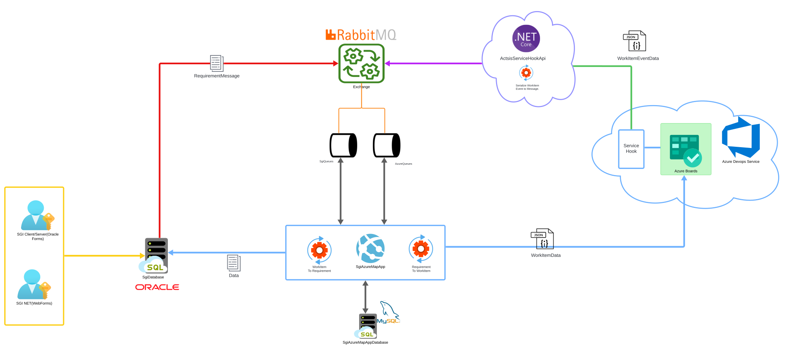

# Integración SGI con Azure Boards

## Descripción General
Este documento describe la arquitectura y el flujo de datos entre el **Sistema de Gestión Interna (SGI)** y **Azure Boards**, utilizando **RabbitMQ** como broker de mensajería y APIs para la sincronización de requisitos (Requirements) y elementos de trabajo (Work Items).

## Diagrama de Arquitectura


---

## Componentes Principales
### 1. Sistema de Gestión Interna (SGI)
- Aplicaciones cliente:
  - **SGI ClientServer (Oracle Forms)**
  - **SGI .NET (WebForms)**
- Base de datos: **Oracle**
- Funcionalidad:
  - Gestión y almacenamiento de requisitos (Requirements).
  - Envío de mensajes a RabbitMQ para sincronización con Azure Boards.

### 2. RabbitMQ
- **Exchange** para la comunicación entre SGI y el módulo de integración.
- Colas específicas:
  - **SgiQueue**: Mensajes desde SGI hacia el sistema de integración.
  - **AzureQueue**: Mensajes relacionados con Azure Boards.
- Garantiza comunicación asíncrona y desacoplada entre los sistemas.

### 3. SgiAzureMapApp

[Ver documentación adicional](./SyncSgiAzureWorker/README.md)

- Módulo central de integración.
- Base de datos: **MySQL**
- Funcionalidad:
  - Mapeo de requisitos a Work Items y viceversa.
  - Persistencia de datos temporales.
  - Servicios expuestos para la conversión y sincronización de datos.

### 4. Azure Boards (Azure DevOps)
- Herramienta para la gestión de Work Items.
- Funcionalidad:
  - Creación y gestión de Work Items basados en los requisitos de SGI.
  - Envío de notificaciones automáticas mediante **Service Hooks**.

### 5. ActisServiceHookApi

[Ver documentación adicional](./ActsisServiceHook//README.md)

- API basada en **.NET Core**.
- Recibe eventos de Work Items desde Azure Boards.
- Proporciona datos en formato **JSON** (`WorkItemEventData`) para actualizar SGI.

---

## Flujo de Datos
1. **SGI** gestiona los requisitos y los almacena en su base de datos Oracle.
2. Cuando hay un nuevo requisito, SGI envía un mensaje a **RabbitMQ** a través de **SgiQueue**.
3. **SgiAzureMapApp** consume el mensaje de **SgiQueue**, mapea el requisito y lo transforma en un Work Item para **Azure Boards**.
4. **Azure Boards** gestiona el Work Item y notifica eventos relevantes a través de un **Service Hook** hacia **ActisServiceHookApi**.
5. **ActisServiceHookApi** recibe el evento (`WorkItemEventData`) y actualiza el sistema SGI.

---

## Tecnologías Utilizadas
- **Oracle Database**: Base de datos principal del sistema SGI.
- **RabbitMQ**: Broker de mensajería para comunicación asíncrona.
- **MySQL**: Base de datos utilizada por SgiAzureMapApp para persistencia temporal.
- **.NET Core**: Framework para la creación de APIs.
- **Azure Boards**: Herramienta de gestión de trabajo en Azure DevOps.
- **Service Hooks**: Para automatización de eventos en Azure Boards.

---

## Diagrama de Flujo
```mermaid
graph LR
A[SGI] --> B{RabbitMQ}
B --> C[SgiAzureMapApp]
C --> D[Azure Boards]
D --> E[ActisServiceHookApi]
E --> A
